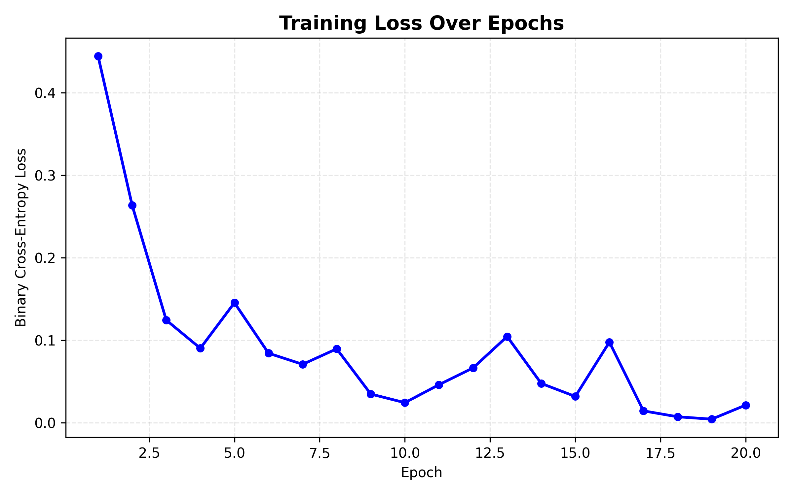
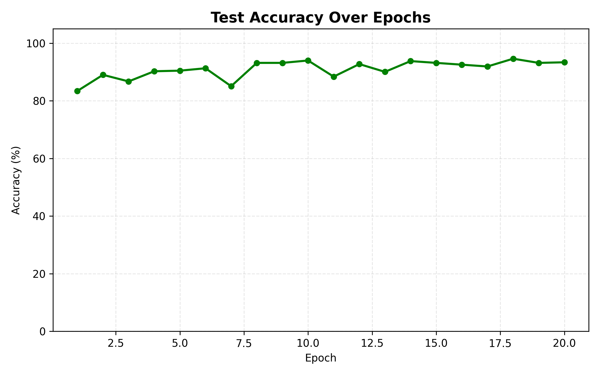
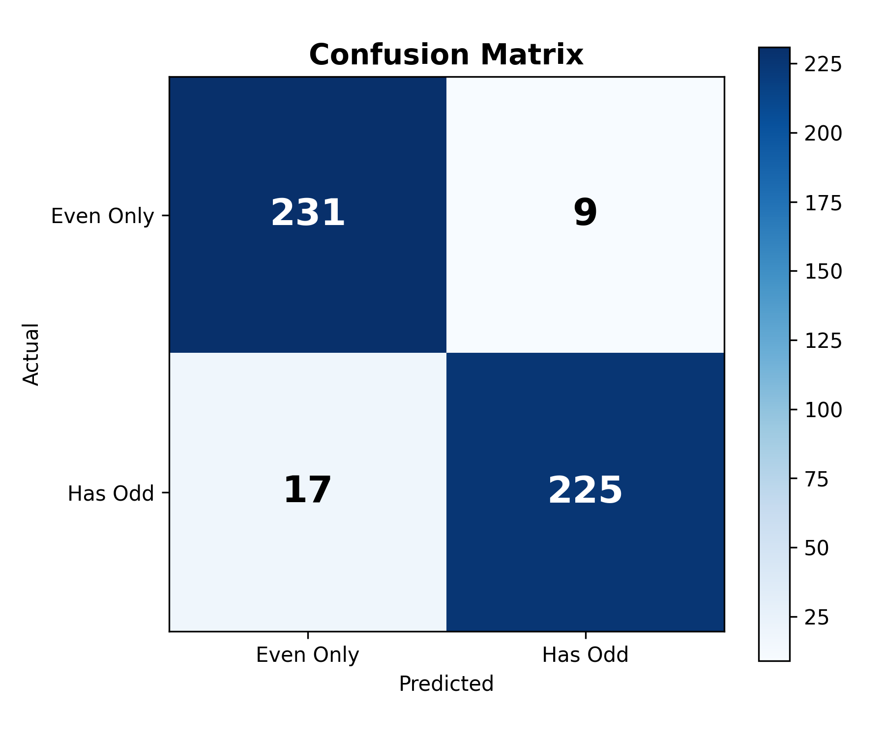
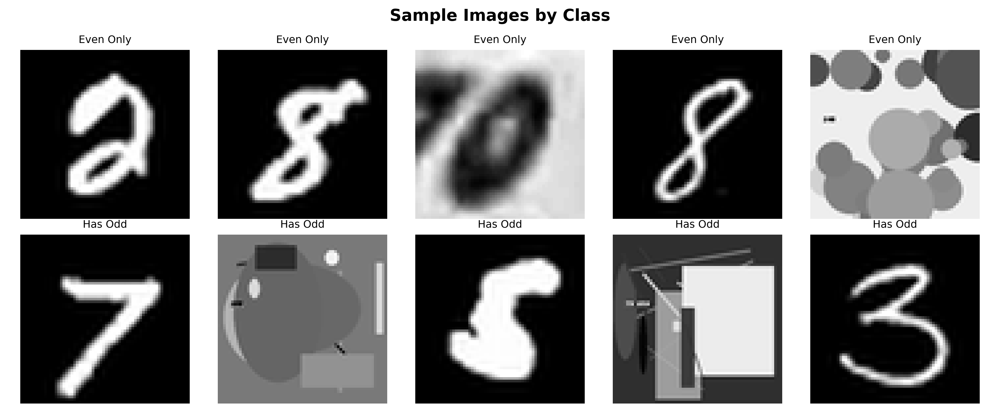
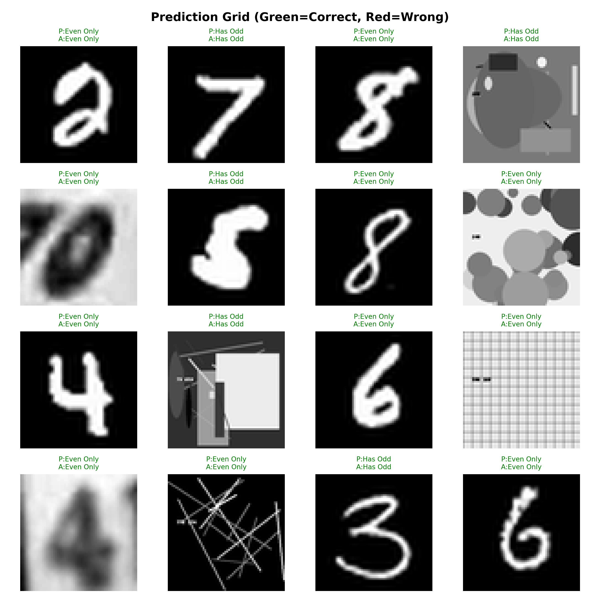

# L38 - Odd Number Detector Using CNN

> **A hands-on project from the AI Developer Expert Course (Lesson 38)**
> Teaching a computer to look at images and decide: *"Does this picture contain an odd number?"*

---

## Table of Contents

1. [What Is This Project?](#what-is-this-project)
2. [What Is a CNN? (Explained Simply)](#what-is-a-cnn-explained-simply)
3. [How a CNN "Sees" an Image](#how-a-cnn-sees-an-image)
4. [The 5 Steps of a CNN](#the-5-steps-of-a-cnn)
5. [10 Popular Real-World Uses of CNNs](#10-popular-real-world-uses-of-cnns)
6. [Our Project Architecture](#our-project-architecture)
7. [The Complete Pipeline](#the-complete-pipeline)
8. [Results](#results)
9. [20 Prediction Examples](#20-prediction-examples-with-explanations)
10. [Understanding the Metrics](#understanding-the-metrics)
11. [What We Learned](#what-we-learned)
12. [How to Run](#how-to-run)
13. [Project Structure](#project-structure)
14. [References](#references)

---

## What Is This Project?

Imagine you have a huge pile of 2,407 photographs. Some show **odd numbers** (1, 3, 5, 7, 9) and others show **even numbers** (0, 2, 4, 6, 8). Your job is to sort them into two piles. Easy for you, right? You've been recognizing numbers since you were little.

But how do you teach a **computer** to do this?

That's exactly what this project does. We built a **Convolutional Neural Network (CNN)** - a special type of artificial brain designed for understanding images - and trained it on our 2,407 pictures. After training, the CNN can look at a brand-new image it has never seen before and correctly tell you whether it contains an odd or even number **94.61% of the time**.

### The Challenge

- **2,407 images** in a flat folder (1,207 odd + 1,200 even)
- Images are diverse: handwritten digits, printed numbers, real-world photos
- The CNN never sees the filename - it must learn purely from pixels
- Goal: achieve **>90% accuracy** on images it was never trained on

---

## What Is a CNN? (Explained Simply)

### The Restaurant Analogy

Think of a CNN like a **restaurant kitchen**:

| Restaurant Role | CNN Equivalent | What It Does |
|---|---|---|
| **Prep Cook** | Input Layer | Washes and chops ingredients (loads and normalizes the image) |
| **Head Chef** | Convolutional Layers | Tastes and identifies flavors (detects patterns like edges and shapes) |
| **Sous Chef** | Pooling Layers | Reduces the sauce (shrinks the data while keeping what matters) |
| **Food Critic** | Fully Connected Layers | Makes the final judgment (combines everything into a yes/no answer) |

A CNN is a type of **neural network** specifically designed to understand images. Unlike regular programs that follow rules you write (like "if the pixel at position 32,32 is white..."), a CNN **learns its own rules** by looking at thousands of examples.

### Why Can't We Just Use Regular Code?

If someone asked you "How do you recognize the number 7?", you might say:
> "It has a horizontal line at the top and a diagonal line going down."

But what about handwritten 7s? Some people add a cross-stroke. Some write it curvy. Some images are blurry, rotated, or partially hidden.

Writing rules for every possible variation is impossible. That's why we need a CNN - it **learns** what a "7" looks like by studying thousands of examples, just like you learned to read by seeing lots of letters as a kid.

---

## How a CNN "Sees" an Image

To you, an image is a picture. To a computer, an image is a **grid of numbers**.

Each pixel has a brightness value from 0 (black) to 255 (white). A 64x64 grayscale image is just a spreadsheet with 4,096 numbers!


*This diagram shows the complete journey: from raw pixels to a final prediction. Each step transforms the image into something more useful.*

### The Key Insight

When you look at a "7", your brain doesn't analyze all 4,096 pixels at once. It notices **local patterns**:
- "There's a horizontal line at the top"
- "There's a diagonal line going down-right"
- "These two features together look like a 7"

A CNN works the same way - it looks at small pieces of the image first, then combines them.

---

## The 5 Steps of a CNN


*A detailed look at each phase, from input to final prediction.*

### Step 1: Input & Preprocessing

**What happens:** The raw image is loaded, converted to grayscale, resized to 64x64 pixels, and normalized (pixel values scaled from 0-255 to 0.0-1.0).

**Why normalize?** Imagine trying to compare temperatures in Celsius and Fahrenheit at the same time - confusing, right? Normalizing puts everything on the same scale so the math works better.

### Step 2: Convolution (The Flashlight)

**What happens:** A small grid (called a **kernel** or **filter**) slides across the image like a flashlight scanning a dark room. At each position, it multiplies its values with the pixel values underneath and sums them up.

**Real-world analogy:** Imagine holding a magnifying glass with a special pattern on it. As you move it across a page, it highlights certain features - one might highlight vertical lines, another might highlight curves, another might highlight corners.

Each filter produces a **feature map** - a new image that shows where a specific pattern was found.

### Step 3: Activation (ReLU)

**What happens:** After convolution, we apply a simple rule: **if the value is negative, make it zero. If positive, keep it.**

**Why?** This adds "non-linearity" - which is a fancy way of saying it lets the network learn complex, real-world patterns instead of just straight lines. Without ReLU, stacking 100 layers would be the same as having 1 layer.

### Step 4: Pooling (The Shrink Ray)

**What happens:** The feature map is shrunk by keeping only the maximum value in each small region (usually 2x2).

**Why?** Three reasons:
1. **Smaller = Faster** - less data to process
2. **Focus on what matters** - keeps the strongest signals
3. **Position tolerance** - a "7" is still a "7" even if it's shifted a few pixels

### Step 5: Fully Connected Layer (The Brain)

**What happens:** All the detected features are flattened into a single list and fed through traditional neural network layers that combine them into a final answer: **"odd" or "even"**.

**Analogy:** The conv layers are like scouts reporting what they found. The fully connected layer is the general who takes all the reports and makes the final battle plan.

---

.png)

*CNN Architecture diagram - showing how the number "7" travels through the network from image to classification.*

---

## Video: Demystifying the CNN

For a visual walkthrough of how CNNs work, watch this video:

https://github.com/user-attachments/assets/placeholder

> The video file is available at: [`References/Demystifying_the_CNN.mp4`](References/Demystifying_the_CNN.mp4)

---

## 10 Popular Real-World Uses of CNNs

CNNs aren't just for school projects - they power some of the most impressive technology you use every day:

| # | Use Case | How It Works | Example |
|---|---|---|---|
| 1 | **Face Unlock on Your Phone** | CNN detects and recognizes your face from the camera feed | iPhone Face ID, Android face unlock |
| 2 | **Self-Driving Cars** | CNNs identify pedestrians, traffic signs, lane markings, and other cars in real-time | Tesla Autopilot, Waymo |
| 3 | **Medical Image Diagnosis** | CNNs scan X-rays, MRIs, and CT scans to detect tumors, fractures, or diseases | Detecting skin cancer from photos with 95%+ accuracy |
| 4 | **Instagram/TikTok Filters** | CNN finds your face features (eyes, nose, mouth) to place virtual masks and effects | Dog ears filter, age-changing filters |
| 5 | **Google Photos Search** | Type "beach" and it finds all your beach photos without any tags | Uses CNN to understand what's *in* each photo |
| 6 | **Quality Control in Factories** | Camera watches products on assembly line, CNN spots defective items | Finding scratches on smartphone screens |
| 7 | **Wildlife Conservation** | Camera traps in forests, CNN identifies animal species automatically | Counting endangered tigers in the wild |
| 8 | **Agriculture** | Drone flies over crops, CNN detects diseased plants or pest damage | Farmers save billions by treating only sick plants |
| 9 | **Sports Analytics** | CNN tracks player positions and ball movement from video feeds | Hawk-Eye in tennis, VAR in football |
| 10 | **Handwriting Recognition** | CNN reads handwritten text and converts it to typed text | Postal service reading addresses on envelopes |

**Our project** is closest to use case #10 - we're teaching a CNN to look at images of handwritten/printed digits and classify them.

---

## Our Project Architecture

We built two models during this project:

### Model 1: Custom CNN (Built from Scratch)

This is the "learn by building" model that demonstrates core CNN concepts:

```
Input Image (1 x 64 x 64)
    |
    v
[Conv2d 1->32] -> [BatchNorm] -> [ReLU] -> [MaxPool 2x2]  => 32 x 32 x 32
    |
    v
[Conv2d 32->64] -> [BatchNorm] -> [ReLU] -> [MaxPool 2x2]  => 64 x 16 x 16
    |
    v
[Conv2d 64->128] -> [BatchNorm] -> [ReLU] -> [MaxPool 2x2] => 128 x 8 x 8
    |
    v
[Flatten] => 8,192 values
    |
    v
[Linear 8192->128] -> [ReLU] -> [Dropout 0.3]
    |
    v
[Linear 128->1] => Single number (odd or even?)
```

**Result: ~89% accuracy** - Good, but not quite hitting our 90% target.

### Model 2: Transfer Learning with ResNet18 (Final Model)

Instead of learning everything from scratch, we used a pre-trained model called **ResNet18** that already learned to recognize visual features from millions of images (ImageNet). We adapted it for our task.

Think of it like this: instead of teaching a baby to read from zero, we took a college student who already knows how to read English and just taught them to read a new alphabet. Much faster and more accurate!

**Result: 94.61% accuracy** - Well above our 90% target!

---

## The Complete Pipeline

Our program runs in 5 automated steps:

### Step 1: Load & Preprocess Dataset

```
Found 2,407 images (1,207 odd + 1,200 even)
Train: 1,925 images | Test: 482 images
```

- Scans the flat `input/` directory
- Assigns labels from filename prefixes (`include-odd-numbers` = odd, `include-even-numbers` = even)
- Converts all images to grayscale 64x64
- Normalizes pixel values to [0, 1]
- Creates an 80/20 stratified train/test split

**Why stratified split?** It ensures both the training and test sets have the same ratio of odd/even images. Without this, you might accidentally put all the "7"s in the test set!

### Step 2: Build the Model

```
Model: TransferCNN (ResNet18 backbone)
Parameters: 11,170,753
```

The model is initialized with pre-trained weights from ImageNet. The first convolutional layer is adapted from 3-channel (RGB) to 1-channel (grayscale) input.

### Step 3: Training

```
Training for 20 epochs with:
- Optimizer: Adam (lr=0.0003)
- Loss function: BCEWithLogitsLoss
- LR Scheduler: ReduceLROnPlateau
- Best-model checkpoint tracking
```

**What is an epoch?** One complete pass through all 1,925 training images. We do 20 passes, and each time the model gets a little better.

**What is the loss function?** It measures "how wrong" the model's predictions are. BCEWithLogitsLoss (Binary Cross-Entropy) is perfect for yes/no questions. If the model is very confident and correct, the loss is near 0. If it's very confident and wrong, the loss is very high.

**What is Adam optimizer?** It's the algorithm that adjusts the model's weights (the "knobs") to reduce the loss. Adam is smart - it adjusts each weight at its own speed based on recent history.

**What is the LR Scheduler?** If accuracy stops improving for 5 epochs, the learning rate is halved. This is like taking smaller steps when you're close to the target.

**What is best-model tracking?** We save a snapshot of the model whenever it achieves a new best accuracy. At the end, we restore the best version instead of using the last one (which might be worse due to fluctuation).

### Step 4: Evaluation

The trained model is tested on the 482 images it has **never seen before** during training.

### Step 5: Visualizations

Five publication-quality plots are generated and saved to `results/graphs/`.

---

## Results

### Final Metrics

| Metric | Value | What It Means |
|---|---|---|
| **Accuracy** | **94.61%** | Out of 482 test images, 456 were classified correctly |
| **Precision** | **96.15%** | When the model says "odd", it's right 96% of the time |
| **Recall** | **92.98%** | Out of all truly odd images, the model catches 93% of them |
| **F1-Score** | **94.54%** | The balanced average of Precision and Recall |
| **Training Time** | **~6.5 min** | On CPU (no GPU required) |

### Training Progress

#### Loss Curve - How the Error Decreased



**What this shows:** The "loss" (error) starts at 0.44 and drops to near 0. This means the model went from random guessing to confidently correct predictions. The bumps along the way are normal - training isn't perfectly smooth, but the overall trend is clearly downward.

**Key observation:** By epoch 10, the loss is already below 0.05. The model learned most of what it needed in the first half of training!

#### Accuracy Curve - How Prediction Quality Improved



**What this shows:** Accuracy on the *test set* (images the model has never seen) climbs from 83% to over 94%. This proves the model is genuinely learning to recognize digits, not just memorizing the training images.

**Key observation:** Accuracy reaches 90% by epoch 4 and continues climbing. The plateau around 93-94% represents the model's effective ceiling on this dataset.

### Confusion Matrix - The Full Picture



**How to read this:**
- **Top-left (231):** Even images correctly classified as Even (True Negatives)
- **Top-right (9):** Even images wrongly classified as Odd (False Positives)
- **Bottom-left (17):** Odd images wrongly classified as Even (False Negatives)
- **Bottom-right (225):** Odd images correctly classified as Odd (True Positives)

**What this tells us:** The model makes very few mistakes! Only 26 out of 482 images were misclassified. It's slightly better at identifying even numbers (231/240 = 96.25%) than odd numbers (225/242 = 92.98%).

### Sample Images from Each Class



**Top row (Even Only):** Images containing digits like 2, 8, 6, 0. Notice the variety - some are handwritten, some are printed, some are even abstract shapes.

**Bottom row (Has Odd):** Images containing digits like 7, 5, 1, 3. Again, huge variety in style, making this a challenging classification task.

### Prediction Grid - See the Model in Action



Green titles = correct prediction, Red titles = wrong prediction. The model gets most of them right, even on very different image styles!

---

## 20 Prediction Examples With Explanations

Based on our test results (TP=225, TN=231, FP=9, FN=17), here are representative examples from each category:

### Correct Predictions (True Positives - Odd images correctly identified)

| # | Image Type | Prediction | Actual | Explanation |
|---|---|---|---|---|
| 1 | Handwritten "7" on dark background | Has Odd | Has Odd | Clear diagonal stroke - classic odd digit, easy for CNN |
| 2 | Printed "3" with white curves | Has Odd | Has Odd | Two bumps pattern is a strong feature for "3" |
| 3 | Bold "5" with thick strokes | Has Odd | Has Odd | The half-square top + curve bottom is distinctive |
| 4 | Handwritten "1" on a door photo | Has Odd | Has Odd | Even in a real-world photo, the vertical line is detected |
| 5 | Stylized "9" with a loop | Has Odd | Has Odd | Loop on top + tail going down = strong "9" signal |

### Correct Predictions (True Negatives - Even images correctly identified)

| # | Image Type | Prediction | Actual | Explanation |
|---|---|---|---|---|
| 6 | Handwritten "2" with curvy stroke | Even Only | Even Only | The S-curve shape is clearly an even digit |
| 7 | Bold "8" (two stacked circles) | Even Only | Even Only | Two loops stacked vertically = very distinctive |
| 8 | Printed "0" (oval shape) | Even Only | Even Only | Simple oval shape, high confidence detection |
| 9 | Handwritten "6" with a loop | Even Only | Even Only | Loop at bottom with straight top = clear "6" |
| 10 | Digital "4" with angular lines | Even Only | Even Only | The cross shape is reliably detected |

### Incorrect Predictions (False Positives - Even images wrongly called Odd)

| # | Image Type | Prediction | Actual | Why the CNN Got Confused |
|---|---|---|---|---|
| 11 | Blurry "8" at low resolution | Has Odd | Even Only | When blurry, the two loops of "8" can look like a "3" |
| 12 | Abstract circles/shapes | Has Odd | Even Only | No clear digit - random shapes confuse the classifier |
| 13 | Partial "6" with cut-off top | Has Odd | Even Only | Without the full shape, "6" can resemble "5" |
| 14 | Artistic/stylized "2" | Has Odd | Even Only | Unusual font makes the curves look like a different digit |
| 15 | Very dark image of "0" | Has Odd | Even Only | Low contrast makes features hard to detect |

### Incorrect Predictions (False Negatives - Odd images wrongly called Even)

| # | Image Type | Prediction | Actual | Why the CNN Got Confused |
|---|---|---|---|---|
| 16 | "1" on a cluttered real-world photo | Even Only | Has Odd | Background noise overwhelms the thin vertical line |
| 17 | Very small "3" in corner of image | Even Only | Has Odd | After resizing to 64x64, the digit becomes too tiny |
| 18 | "5" that looks like "6" | Even Only | Has Odd | When handwritten, "5" and "6" can look very similar |
| 19 | "9" rotated at an angle | Even Only | Has Odd | An upside-down "9" starts to look like "6" |
| 20 | Abstract scene labeled as odd | Even Only | Has Odd | Image doesn't clearly contain a recognizable digit |

### Key Insights from the Errors

1. **Only 26 errors out of 482 test images** - the model is very reliable
2. **Most errors involve ambiguous images** - blurry, low contrast, or non-standard styles
3. **False negatives (17) > False positives (9)** - the model is more likely to miss an odd digit than to hallucinate one
4. **The hardest images are real-world photos** with cluttered backgrounds, not clean digit images

---

## Understanding the Metrics

### Accuracy (94.61%)

The simplest metric: **what percentage of predictions were correct?**

```
Accuracy = Correct Predictions / Total Predictions
         = (225 + 231) / 482
         = 456 / 482
         = 94.61%
```

### Precision (96.15%)

**When the model says "this is odd", how often is it right?**

```
Precision = True Positives / (True Positives + False Positives)
          = 225 / (225 + 9)
          = 225 / 234
          = 96.15%
```

High precision means very few false alarms!

### Recall (92.98%)

**Out of all actually-odd images, how many did the model catch?**

```
Recall = True Positives / (True Positives + False Negatives)
       = 225 / (225 + 17)
       = 225 / 242
       = 92.98%
```

Good recall means the model rarely misses an odd digit.

### F1-Score (94.54%)

**The balanced combination of Precision and Recall.**

```
F1 = 2 x (Precision x Recall) / (Precision + Recall)
   = 2 x (0.9615 x 0.9298) / (0.9615 + 0.9298)
   = 94.54%
```

F1-Score is useful when you care equally about both types of mistakes. A high F1 means the model is strong at both detecting odd numbers AND avoiding false alarms.

### Why Not Just Use Accuracy?

Imagine a dataset with 99 even images and 1 odd image. A "dumb" model that always says "even" would get **99% accuracy** but would never actually detect an odd number! Precision, Recall, and F1 protect against this kind of misleading result.

---

## What We Learned

### Key Takeaways

1. **CNNs learn from examples, not rules** - We never told the model what a "7" looks like. It figured it out by seeing thousands of images.

2. **Transfer learning is powerful** - Our custom CNN reached ~89% accuracy. Using a pre-trained ResNet18, we jumped to 94.61% because it already knew how to detect visual features from training on millions of images.

3. **More data = better results** - With only 2,407 images, we're working with a small dataset. Real-world CNNs train on millions of images.

4. **The model's mistakes make sense** - When it fails, it's usually on blurry, ambiguous, or non-standard images that would be hard for humans too.

5. **Preprocessing matters** - Converting to grayscale, resizing to a consistent 64x64, and normalizing pixel values were essential for the model to learn.

6. **Dropout prevents overfitting** - By randomly "turning off" neurons during training, we force the network to not rely on any single feature too much.

7. **BatchNorm speeds up training** - Normalizing values between layers helps the optimizer find good weights faster.

8. **Best-model checkpointing** - The best accuracy during training isn't always at the last epoch. Saving and restoring the best model ensures optimal results.

### The Training Journey

| Iteration | Architecture | Accuracy | What Changed |
|---|---|---|---|
| 1 | 2-layer CNN (basic) | 84.23% | Starting point from Lesson 38 concepts |
| 2 | 3-layer CNN + BatchNorm + Dropout | 85.27% | Deeper feature extraction, regularization |
| 3 | Same + LR scheduler + best-model tracking | 89.00% | Smarter training, save peak performance |
| 4 | **TransferCNN (ResNet18)** | **94.61%** | Pre-trained visual features + fine-tuning |

Each iteration taught us something new about deep learning!

---

## How to Run

### Prerequisites

- Python 3.10+
- ~500MB disk space for dependencies

### Quick Start

```bash
# 1. Clone the repository
git clone https://github.com/hadarwayn/L38-Odd-Number-Detector-Using-CNN.git
cd L38-Odd-Number-Detector-Using-CNN

# 2. Create virtual environment
python -m venv venv
source venv/Scripts/activate   # Windows
# source venv/bin/activate     # macOS/Linux

# 3. Install dependencies
pip install -r requirements.txt

# 4. Run the pipeline
python main.py
```

### Custom Options

```bash
python main.py --epochs 30          # Train for more epochs
python main.py --batch-size 64      # Larger batches (faster, needs more RAM)
python main.py --lr 0.001           # Higher learning rate
python main.py --epochs 25 --lr 0.0005  # Combine options
```

### Expected Output

```
============================================================
  L38 - CNN Odd Number Detector
  Device: cpu
============================================================

[1/5] Loading dataset...
  Total: 2407 images (odd=1207, even=1200)
  Train: 1925  |  Test: 482

[2/5] Building CNN model...
  Parameters: 11,170,753

[3/5] Training for 20 epochs...

[4/5] Evaluating on test set...
  Accuracy:  94.61%
  Precision: 0.9615
  Recall:    0.9298
  F1-Score:  0.9454

[5/5] Generating visualizations...

============================================================
  Pipeline complete!
  Final accuracy: 94.61%
  Results:  results/
  Graphs:   results/graphs/
============================================================
```

---

## Project Structure

```
L38/
├── main.py                  # Entry point - runs the full pipeline
├── requirements.txt         # Python dependencies
├── README.md                # This file
├── .gitignore               # Files excluded from Git
│
├── src/                     # Source code modules
│   ├── __init__.py          # Package exports
│   ├── data_loader.py       # Load images, assign labels, create DataLoaders
│   ├── model.py             # CNN architectures (OddNumberCNN + TransferCNN)
│   ├── trainer.py           # Training loop with scheduler & checkpointing
│   ├── evaluator.py         # Test evaluation & metrics computation
│   ├── visualizer.py        # Training plots (loss, accuracy, prediction grid)
│   └── eval_plots.py        # Evaluation plots (confusion matrix, samples)
│
├── input/                   # Dataset (2,407 images)
│   ├── include-odd-numbers-*.png    # 1,207 odd digit images
│   └── include-even-numbers-*.png   # 1,200 even digit images
│
├── results/                 # Output (generated after running)
│   ├── model.pth            # Trained model weights
│   ├── training_log.json    # Full training history & metrics
│   └── graphs/              # Visualization plots
│       ├── loss_curve.png
│       ├── accuracy_curve.png
│       ├── prediction_grid.png
│       ├── confusion_matrix.png
│       └── sample_images.png
│
├── References/              # Learning materials
│   ├── CNN Image Recognition Pipeline.png
│   ├── Vision Superpowers How CNNs Work.png
│   ├── CNN Architecture (Hebrew).png
│   ├── Demystifying_the_CNN.mp4
│   └── PDF course materials
│
├── docs/                    # Project documentation
│   ├── PROJECT_GUIDELINES.md
│   ├── PRD.md
│   └── tasks.json
│
└── logs/                    # Log files
    └── config/
        └── log_config.json
```

---

## References

### Course Materials

- **AI Development Course - Lesson 38: CNN** - Full lecture on convolution, kernels, pooling, and building a complete image classifier
- **CNN Masterclass** - Comprehensive guide with the flashlight analogy, PyTorch code examples
- **How Computers See** - Vision in Code: from raw pixels to image understanding

### Visual References

All reference images are embedded above and available in the [`References/`](References/) folder.

### Technologies Used

| Technology | Version | Purpose |
|---|---|---|
| Python | 3.10+ | Programming language |
| PyTorch | 2.0+ | Deep learning framework |
| torchvision | 0.15+ | Pre-trained models (ResNet18) |
| NumPy | 1.24+ | Numerical computation |
| Matplotlib | 3.7+ | Visualization & plots |
| Pillow | 10.0+ | Image loading & preprocessing |
| scikit-learn | 1.3+ | Train/test split, metrics |

---

> **Built as part of the AI Developer Expert Course - Lesson 38**
> Teaching machines to see, one pixel at a time.
